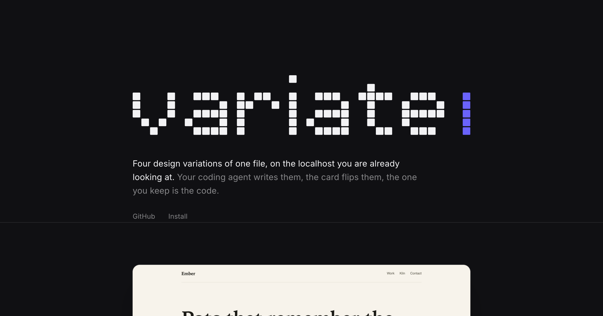

<p align="center">
  <a href="https://variate-skill.vercel.app">
    
  </a>
</p>

<h1 align="center">variate</h1>

<p align="center">
  Your agent writes four real versions of one file; arrow keys flip them on the localhost you are already looking at. The one you keep is the code. <a href="https://variate-skill.vercel.app">variate-skill.vercel.app</a>
</p>

## Tech stack

- Node 18 builtins only: zero dependencies, no package.json, nothing to build
- A vanilla JS card in a shadow root, injected into your own dev page
- A 127.0.0.1 sidecar that serves the card and switches files, with SSE for live state
- SKILL.md and AGENTS.md as the agent contracts (Claude Code, Codex CLI, opencode, Cursor, anything with a shell)
- Three shell smoke suites as the whole test harness

## Cloning & running

1. Install the skill: `npx skills add Luffixos/variate`
2. Or clone once and link every agent on the machine (`git pull` then updates them all):

   ```bash
   git clone https://github.com/Luffixos/variate ~/code/variate
   node ~/code/variate/scripts/install.mjs
   ```

3. Optional, Claude Code only: `node ~/code/variate/scripts/install.mjs --hooks` lets a card click reach your agent while it sits idle. `--hooks --remove` takes it back out.
4. In any project: ask your agent for `/variate four takes on the hero`.
5. Hacking on variate itself: `node dev/fixture.mjs`, then `node variate.mjs up --root <that copy>`, and `dev/smoke-cli.sh && dev/smoke-http.sh && dev/smoke-card.sh`.

## Roadmap

- [ ] React Server Components: understand the server/client boundary instead of linting around it
- [ ] Pick through shadow DOM and iframes, the two places a click still cannot see
- [ ] Windsurf and the long tail of agents that read `.agents/skills`
- [ ] List on the skills.sh directory once the repo is public
- Voice input is skipped on purpose: browser speech-to-text ships audio to a third party, which breaks the local-only promise.

## Security

Everything runs on 127.0.0.1 behind an Origin allowlist and a per-project token: no accounts, no telemetry, no network calls, and `.variate/` is gitignored. `variate end` removes every trace and leaves `git diff` showing the design you chose and nothing else. The full threat model, including the one residual risk worth knowing, is in [SECURITY.md](SECURITY.md).

MIT. The vendored Inter typeface is by Rasmus Andersson, under the SIL Open Font License 1.1 (`client/inter/OFL.txt`).
