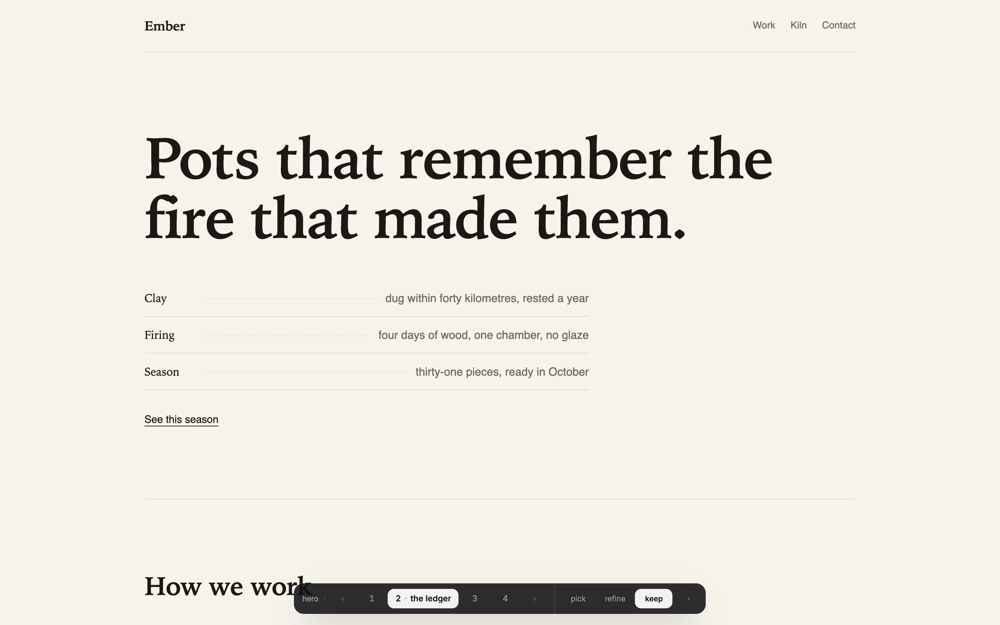

# variate

Four design variations of a section, on the localhost you are already looking
at, flipped with the arrow keys.

Your coding agent writes real alternatives of one of your files. A small card
appears at the bottom of your own dev server's page. You press ← and → and the
page changes. When one feels right you press enter (or the keep button): your
agent wraps the round up, the alternatives disappear, and the chat continues
from your decision.



One page tells the whole story: <https://variate-skill.vercel.app>

## Why it is built this way

Switching **writes the real file** and lets your own dev server re-render it.
That one decision removes almost everything else: there is no preview server,
no wrapper component, no iframe, no hydration risk, no build step, no
dependency added to your project, and no "keep" step at the end, because what
you are looking at is already the code that ships. It also means variate works
the same on React, Vue, Svelte, Astro, Rails, or a single HTML file, and works
on components, whole pages, and theme files alike.

- **Nothing is variate-shaped.** A variant is a `.tsx`, or a `.vue`, or a
  `.css`. Its only contract is that it drops in where the original was.
- **Your original is variant 1**, never edited. Flipping back to it is one key.
- **A hand edit is never lost.** If you edit the live file yourself, the next
  switch keeps it as a new variant first.
- **Which variant is live is derived, not stored**, so it cannot drift out of
  sync with your files.
- **Your agent stays at the table.** After presenting a round it keeps
  listening for a couple of minutes, so a quick keep or refine reaches it in
  seconds. Decide later and it picks your click up the moment you send it
  anything. On Claude Code you can make even that unnecessary: see below.
- **`variate end` leaves a clean diff**: `git diff` shows the design you chose
  and nothing else. It also stops variate's own background process (the
  sidecar); there is nothing to pkill.

## Use

In your agent, in a project you are already running:

```
/variate give me four takes on the hero
```

Or in an empty folder, with nothing at all:

```
/variate design a landing page for my invoicing tool
```

variate writes a page, serves it, and puts four fresh designs behind the card.
There is no setup step and nothing to scaffold first. It reads the other way
too: point it at a page that already works ("who else could this hero have
been?") and the original stays parked on position 1 while you look.

Or drive it yourself:

```bash
node variate.mjs up   --root .            # card appears on your page
node variate.mjs add  src/components/Hero.tsx
# your agent writes .variate/hero/plan.json and 2.tsx, 3.tsx, 4.tsx
node variate.mjs use  hero 3              # or just press 3 on the card
node variate.mjs end                      # keep what is live, remove variate
```

Keys: `←` `→` flip · `1`-`9` jump · the one you are on again to **replay** it ·
`enter` keep · `[` `]` change section · `esc` hide · `?` help.

The card carries the whole loop: **keep** locks in the one you are looking at
and hands the round back to your agent, **refine** takes a one line steer
("more like this, but calmer", or "2's layout with 3's palette", where each
part arrives whole from one position rather than blended), and **pick** lets
you click any section of your page to start a round on it. The position you are on wears its name, and
hovering any of them tells you what it changes and what that costs, so you are
reading the tradeoff at the moment you decide rather than in a chat message.

Clicking the position you are already on re-renders it, which is how you watch
an entrance animation more than once. The card moves to the top by itself if
your design has something pinned to the bottom of the screen, and
`?variate=hero:3` opens straight onto a position.

Your agent writes the round into `.variate/<set>/plan.json`: the question it
is asking, and for each position a name, what it changes, and what it gives
up. As you settle pieces, `variate status` shows what is done beside what is
still open, and every direction you turned down, so a later round does not
offer one back as a fresh idea. The last `variate end` recaps the session.

## Install

```bash
git clone https://github.com/Luffixos/variate ~/code/variate
node ~/code/variate/scripts/install.mjs
```

Node 18 or later is the whole requirement: zero dependencies, no package.json,
nothing to build. The installer links variate into every agent it finds on the
machine (Claude Code, Codex CLI, opencode), so `git pull` updates all of them
at once. `--dry-run` shows what it would do, `--remove` undoes it, `--copy`
installs copies instead of symlinks.

Optional, Claude Code only:

```bash
node ~/code/variate/scripts/install.mjs --hooks
```

This adds two Stop hooks to your own `~/.claude/settings.json` so a click on
the card reaches your agent while it is sitting idle, instead of waiting for
your next message. It backs the file up first, leaves your other hooks alone,
and `--hooks --remove` takes it back out. In any project without a
`.variate/` directory the hooks exit in milliseconds having done nothing.

Anything that can run a shell command works too: `node variate.mjs up` prints
what to do next, and `AGENTS.md` is the whole contract in one page.

## What it puts in your project

One dev-only, marker-bracketed line in your entry file, and `.variate/`
(gitignored) holding the alternatives. `variate end` removes both.

Everything stays on `127.0.0.1`: an Origin allowlist, a per-project token, no
accounts, no telemetry, and no network calls. Anything that writes (switching,
ending, queuing an ask) additionally needs a request that a page on another
site cannot forge: a real localhost Origin and an `Authorization` header. The
token alone is not treated as proof, because a page that can run a script tag
can read it.

## Honest limits

Flip latency is your dev server's: usually under 150ms on Vite, 200-400ms on
Next, and a full reload where there is no HMR. Plain HTML reloads. A modal
`<dialog>` opened after the card can cover it; the keys still work. Finding
which file a clicked section came from is a text search of your repo, not a
source map, because source mapping is unreliable on modern bundlers and lying
about it would be worse. The agent listens for about two minutes after each
round; after that, clicks queue on disk and are picked up on your next
message (on Claude Code, hooks pick them up sooner).

## Dev

```bash
node dev/fixture.mjs                      # a real page to try the card on
node variate.mjs up --root <that copy>    # attach and start
dev/smoke-cli.sh && dev/smoke-http.sh && dev/smoke-card.sh
```

## License

MIT. The vendored Inter typeface is by Rasmus Andersson, under the SIL Open
Font License 1.1 (`client/inter/OFL.txt`).
